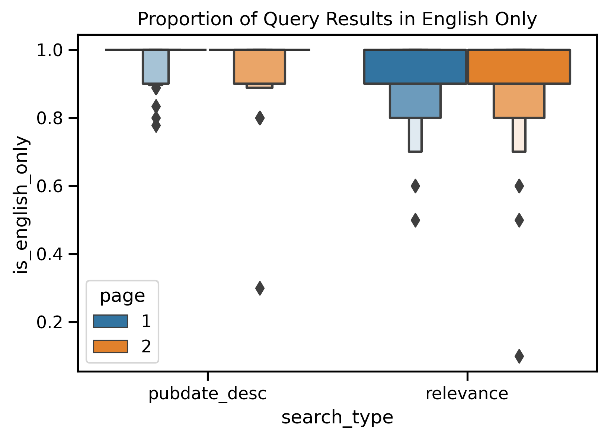

# JUST RETRIEVAL
## pubmed-codeathon-team1

[Wiki link](https://github.com/NCBI-Codeathons/pubmed-codeathon-team1/wiki/Data-Management-Team---Scratch)

## Table of Contents

1. [Abstract](#abstract)
2. [Introduction](#introduction)
3. [Methods](#methods)
4. [Data Info](#data-info)
5. [Results](#results)
6. [Discussion](#discussion)
7. [Conclusion](#conclusion)
8. [References](#references)
9. [Acknowledgement](#acknowledgements)
10. [Team Members](#team-members)

# ABSTRACT
The goal of JUST RETRIEVAL is to describe any potential biases that exist in search results based on PubMed Best Search Algorithm in comparing the retrieved results between different pages as well as to search results from a different search algorithm (publication date sort algorithm). We achieved this by selecting various correlates that can be broadly divided into author attributes and publication attributes. PubMed and iCite APIs were queried to retrieve top 20 results for these two algorithms and the results were compared across the select correlated. _Add a statement about results and a conclusion_

# INTRODUCTION

Understanding and mitigating bias in medical information is critical to promoting health equity in biomedical research and practice. This includes how scholarly research is retrieved and presented to the end users. PubMed is a free search engine used by millions of users around the world to access ever expanding scholarly literature and resources in biomedical sciences. The NCBI/NLM at the NIH develops and maintains PubMed including the search and retrieval aspects to provide the most relevant information to user searches. In 2018, NCBI team has implemented new search algorithm called Best Match [1] to provide more relevant search results replacing an algorithm based on date sort order. The Best Match algorithm accomplishes this by combining user intelligence (past user searches with relevance ranking factors) with machine learning techniques. As with any AI/ML algorithm, it is important to ensure that the search results are fair and unbiased to avoid or mitigate bisinformation or biased information [2]. Some of the biases in algorithms may stem from the use of past feedback that can lead to "rich-get-richer dynamics", i.e. items ranked higher can reinforce feedback loops influencing future ranking [3]. With Best Match algorithm, any biases in training data, for instance with user searches and clicks, can by default manifest as an inequitous, common view of the world presented to diverse users [4].

### Scope and Research Questions
The focus for this project is to answer the following research questions:

* RQ1: Is there a correlation between various author attributes and retrieved best match search results?
* RQ2: Is there a difference between search results between best search and date order search by author attributes?
* RQ3: Is there a correlation between various publication attributes and retrieved best match search results?
* RQ4: Is there a difference between search results between best search vs. date order search by Publication Attributes?

The author attributes that were considered are: gender, race, institutional affiliation, country of origin, and author authority (e.g., research impact based on number of hits). The publication attributes that were considered are: NIH funding, language of publication, reading level, diversity of references, associated data, and number of authors and affiliations.

We filtered out certain publication types such as books, errata, and commentary and have relied on both past user search behaviors as well as custom search keywords across these categories: Rare diseases, signaling pathways, social determinants of health and health equities, list of autoimmune diseases, list of cells, infectious bacteria, list of medical devices, and list of drugs.

# METHODS
### Basic Workflow

1. Read the CSV files of search terms to use as search parameters for PubMed API.
2. Connect to the APIs (<a href="https://ncbiinsights.ncbi.nlm.nih.gov/2022/03/24/test-server-pubmed-api/">PubMed's eUtils - both BestMatch and Publication Date sort endpoints</a>) to retrieve PMIDs and corresponding data. 
3. Query and retrieve (both Best Match and Date Sort implementations) author and publication attributes for 1st 2 pages (1st 20 results).
     3.1 For author attributes, use additional packages, Python's <a href="https://github.com/appeler/ethnicolr">Ethnicolr</a> and <a href="https://pypi.org/project/Genderize/">Genderize</a>, to derive gender and race. 
     3.2 For publication attributes, use content from iCite for additional data points.
4. With the help of <a href="https://pandas.pydata.org">Pandas</a> and other data management libraries, write feature outputs for rollups of (query, first / second page and Pubmed ranking algorithms) to <a href="https://github.com/NCBI-Codeathons/pubmed-codeathon-team1/tree/main/data/features">feature files</a>. 
5. Use Python's statistics libraries (i.e., <a href="https://pingouin-stats.org">Pinguoin</a>, <a href="https://scipy.org">Scipy</a>)  to:
   5.1 Compare the author and publication attributes in retrieved results for the first page (1st 10 results) with second page (2nd 10 results) of PubMed Best Match algorithm results.
     5.2 Compare the author and publication attributes in retrieved results (just 1st page) between the PubMed Best Search and PubMed Date Sort algorithms.
6. Display the results using Python's visualization libraries (i.e., <a href="https://seaborn.pydata.org">Seaborn</a>, <a href="https://matplotlib.org">Matplotlib</a>) and write observations.

## DATA INFO

### Pipeline

This is the data pipeline that describes the datasets used to produce our analysis. Specific data files are described in detail below.

### Data Files

#### [data/in/team1_search_strats_search_terms.csv](data/in/team1_search_strats_search_terms.csv)

This is a list of search terms that we will use for testing. Comes from a google doc not linked here because I'm not sure we want it public.

Fields:

+ `Query` - query string used to search for publications
+ `Category` - Rare diseases | Signaling pathways | Autoimmune diseases | Cells | Infectious bacteria | Medical devices | Drugs | Social determinants of health, health equities
+ `Source` - link to source of term

#### [data/out/pmids.csv](data/out/pmids.csv)

This is a list of all the pmids for the terms we're interested in. Here's what the fields mean:

+ `pmid`
+ `query` - query string, read in from [./data/in/team1_search_strats_search_term+.csv](data/in/team1_search_strats_search_terms.csv) (from Travis' google doc)
+ `search_type` - relevant | pubdate_desc
+ `page` - 1 | 2

#### [data/out/pmid_data.csv](data/out/pmid_data.csv)

Columns of data pulled directly from the PubMed API or [iCite](https://icite.od.nih.gov/):

**iCite columns**
+ `relative_citation_ratio`,   [RCR](https://journals.plos.org/plosbiology/article?id=10.1371/journal.pbio.1002541) measure of influence
+ `human`,   Prediction from MeSH on human subject
+ `animal`,   Prediction from MeSH on animal subjects
+ `molecular_cellular`,   Prediction from MeSH on cellular subjects
+ `apt`,   Approx. potential to clinically translate
+ `is_clinical`,   Bool, clinical or guideline
+ `citation_count`,   Raw  of citations
+ `cited_by`,   PMIDs of citations
+ `references`,   PMIDs of references

**PubMed columns**
+    `title`
+    `abstract`
+    `journal` - coded as 1 = US, England, or Ireland (UK), 0 = any other country
+    `authors`
+    `affiliations`
+    `pubdate`
+    `mesh_terms`
+    `publication_types`
+    `chemical_list`
+    `keywords`
+    `languages`
+    `country`

#### pmid_xmls

A raw xml response from the pubmed api for each publication. Saved in the format of PMID.xml (e.g., 61455.xml). These aren't used in the analysis as `pmid_data.csv` has all the metadata in csv format. These may be used for confirmation.

##### Notes

This file isn't populated properly for books as it just loads article metadata. This is a small number of items (122 out of 7206 publications) so shouldn't impact results too much. _*TODO:*_ clean up book items

#### data/out/pmid_xmls

A set of raw xml files retrieved for each pmid in the pmids.csv file.

### Feature files

* [readability_fk_score_abstract.csv](./data/features/readability_fk_score_abstract.csv) - median flesch-kincaid score of publication abstract
* [readability_fk_score_title_abstract_combined.csv](./data/features/readability_fk_score_title_abstract_combined.csv) - median flesh-kincaid score of publication title and abstract combined
* [readability_fk_score_title.csv](./data/features/readability_fk_score_title.csv) - median flesch-kincaid score of publication title
* [author_count.csv](./data/features/author_count.csv) - median number of authors per publication
* [affiliation_count.csv](./data/features/affiliation_count.csv) - median number of affiliations per publication
* [author_country.csv](./data/features/affiliation_count.csv) - most common country in page of search results for first authors
* [author_affiliation.csv](./data/features/affiliation_count.csv) - most common affilitions in page of search results for first authors

# RESULTS

<!-- [APT SCORE](https://github.com/NCBI-Codeathons/pubmed-codeathon-team1/blob/main/data/visualizations/apt_score.png)
 -->
 
 
 
 
 
 
 
 
 

# DISCUSSION
_Any insights and their significance to various stakeholders (users, PubMed developers (for improving the product), IR researchers (for further investigation)_

_Limitations_

# CONCLUSION
This study attemnpts to define and measure some correlates related to author attributes and publication attributes that can be basis for bias in the seach results returned by PubMed Best Match.

It is important to detect and mitigate bias in search and retrieval algorithms in order to achieve the three pillars for fairness - transparency, impartiality, and inclusion [5]. Systems continue to be biased as long as the data they receive is biased.  Fairness via AI is based on the assertion that AI can be used to help “detect, mitigate, and remedy situations that are inherently unequal, unjust and unfair in society"[2]. Obermeyer et al [6] offer these strategies to mitigate bias:
* Document algorithms using transparent methods such as including goal, training process and performance
* Set up protocols to mitigate bias by providing a pathway for users to report bias, identification bias
* Establish an ongoing team to oversee bias mitigation measures

Continously training and re-training the learning models using representative and more accurate user search and click through data (as well as collabrative filtering) can help continous detection and elimination of biases. The measures of bias may also need to be defined more clearly and operationalized in future research and implementation. 

_The limitations of the study are _

# REFERENCES

1. Fiorini N, Canese K, Starchenko G, Kireev E, Kim W, Miller V, Osipov M, Kholodov M, Ismagilov R, Mohan S, Ostell J, Lu Z. Best Match: New relevance search for PubMed. PLoS Biol. 2018 Aug 28;16(8):e2005343. doi: 10.1371/journal.pbio.2005343. PMID: 30153250; PMCID: PMC6112631.
2. Dori-Hacohen, S., Montenegro, R., Murai, F., Hale, S., Sung, K., Blain, M., & Edwards-Johnson, J. (2021). Fairness via AI: Bias Reduction in Medical Information. ArXiv, abs/2109.02202.
3. Morik, M., Singh, A., Hong, J., & Joachims, T. (2020). Controlling Fairness and Bias in Dynamic Learning-to-Rank. Proceedings of the 43rd International ACM SIGIR Conference on Research and Development in Information Retrieval.
4. Kiester, Lucy & Turp, Clara. (2022). Artificial intelligence behind the scenes: PubMed’s Best Match algorithm. Journal of the Medical Library Association. 110. 10.5195/jmla.2022.1236.
5. Lever, J., Gakkhar, S., Gottlieb, M., Rashnavadi, T., Lin, S., Siu, C., Smith, M., Jones, M. R., Krzywinski, M., Jones, S., & Wren, J. (2018). A collaborative filtering-based approach to biomedical knowledge discovery. Bioinformatics (Oxford, England), 34(4), 652–659. https://doi.org/10.1093/bioinformatics/btx613
6. Obermeyer, Z., Nissan, R., Stern, M., Eaneff, S., Bembeneck, E. J., & Mullainathan, S. (2021). Algorithmic Bias Playbook. Center for Applied AI at Chicago Booth. 

# ACKNOWLEDGEMENTS

Thanks to [Team4](https://github.com/NCBI-Codeathons/pubmed-codeathon-team4) and [@Danizen](https://github.com/danizen) for their pubmed api code that we used to pull down articles.

# TEAM MEMBERS

* Shruthi Chari (data lead)
* Travis Hoppe (project lead)
* Alex Sticco
* Alexa M. Salsbury
* Ben Rogers
* Brian Lee
* Brooks Leitner
* Caroline Trier
* Linda M. Hartman
* Preeti G. Kochar
* Sridhar Papagari Sangareddy

