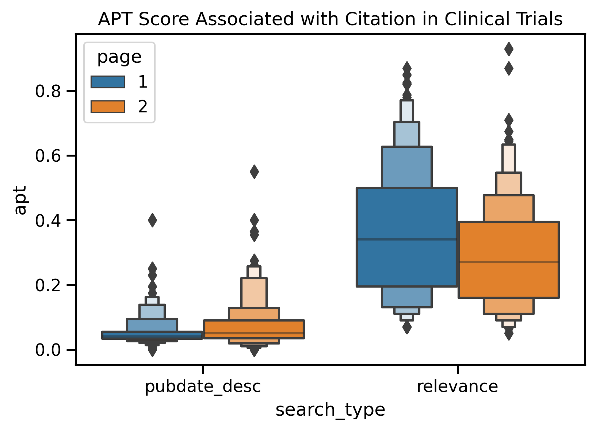

# JUST RETRIEVAL
## pubmed-codeathon-team1

## Table of Contents

1. [Abstract](#abstract)
2. [Introduction](#introduction)
3. [Methods](#methods)
4. [Data Info](#data-info)
5. [Results](#results)
6. [Discussion](#discussion)
7. [Conclusion](#conclusion)
8. [References](#references)
9. [Acknowledgement](#acknowledgements)
10. [Team Members](#team-members)

# ABSTRACT
The goal of JUST RETRIEVAL is to describe any potential biases that exist in search results based on PubMed Best Search Algorithm in comparing the retrieved results between different pages as well as to search results from a different search algorithm (date sort algorithm).

# INTRODUCTION
_Include some background information from the literature review on why is it important to study bias in 1) research, 2) information retrieval and specifically, why is it important to evaluate PubMed best search for any biases_

### Scope and Research Questions
The focus for this project is to answer the following research questions:

* RQ1: Is there a correlation between various author attributes and retrieved best match search results?
* RQ2: Is there a difference between search results between best search and date order search by author attributes?
* RQ3: Is there a correlation between various publication attributes and retrieved best match search results?
* RQ4: Is there a difference between search results between best search vs. date order search by Publication Attributes?

The author attributes that were considered are: gender, race, institutional affiliation, country of origin, and author authority (e.g., research impact based on number of hits). The publication attributes that were considered are: NIH funding, language of publication, reading level, diversity of references, associated data, and number of authors and affiliations.

We filtered out certain publication types such as books, errata, and commentary and have relied on both past user search behaviors as well as custome search keywords across these categories: Rare diseases, signaling pathways, social determinants of health and health equities, list of autoimmune diseases, list of cells, infectious bacteria, list of medical devices, and list of drugs.

# METHODS
### Basic Workflow
_Include a diagram, if time permits  !!_
1. Read the CSV files of search terms to use as search parameters for PubMed API.
2. Connect to the APIs (<a href="https://ncbiinsights.ncbi.nlm.nih.gov/2022/03/24/test-server-pubmed-api/">PubMed's eUtils - both BestMatch and Publication Date sort endpoints</a>) to retrieve PMIDs and corresponding data. 
3. Query and retrieve (both Best Match and Date Sort implementations) author and publication attributes for 1st 2 pages (1st 20 results).
     3.1 For author attributes, use additional packages, Python's <a href="https://github.com/appeler/ethnicolr">Ethnicolr</a> and <a href="https://pypi.org/project/Genderize/">Genderize</a>, to derive gender and race. 
     3.2 For publication attributes, use content from iCite for additional data points.
4. With the help of <a href="https://pandas.pydata.org">Pandas</a> and other data management libraries, write feature outputs for rollups of (query, first / second page and Pubmed ranking algorithms) to <a href="https://github.com/NCBI-Codeathons/pubmed-codeathon-team1/tree/main/data/features">feature files</a>. 
5. Use Python's statistics libraries (i.e., <a href="https://pingouin-stats.org">Pinguoin</a>, <a href="https://scipy.org">Scipy</a>)  to:
   5.1 Compare the author and publication attributes in retrieved results for the first page (1st 10 results) with second page (2nd 10 results) of PubMed Best Match algorithm results.
     5.2 Compare the author and publication attributes in retrieved results (just 1st page) between the PubMed Best Search and PubMed Date Sort algorithms.
6. Display the results using Python's visualization libraries (i.e., <a href="https://seaborn.pydata.org">Seaborn</a>, <a href="https://matplotlib.org">Matplotlib</a>) and write observations.

# DATA INFO

### [data/in/team1_search_strats_search_terms.csv](data/in/team1_search_strats_search_terms.csv)

This is a list of search terms that we will use for testing. Comes from a google doc not linked here because I'm not sure we want it public.

Fields:

+ `Query` - query string used to search for publications
+ `Category` - Rare diseases | Signaling pathways | Autoimmune diseases | Cells | Infectious bacteria | Medical devices | Drugs | Social determinants of health, health equities
+ `Source` - link to source of term

### [data/out/pmids.csv](data/out/pmids.csv)

This is a list of all the pmids for the terms we're interested in. Here's what the fields mean:

+ `pmid`
+ `query` - query string, read in from [./data/in/team1_search_strats_search_term+.csv](data/in/team1_search_strats_search_terms.csv) (from Travis' google doc)
+ `search_type` - relevant | pubdate_desc
+ `page` - 1 | 2

### [data/out/pmid_data.csv](data/out/pmid_data.csv)

Columns of data pulled directly from the PubMed API or [iCite](https://icite.od.nih.gov/):

**iCite columns**
+ `relative_citation_ratio`,   [RCR](https://journals.plos.org/plosbiology/article?id=10.1371/journal.pbio.1002541) measure of influence
+ `human`,   Prediction from MeSH on human subject
+ `animal`,   Prediction from MeSH on animal subjects
+ `molecular_cellular`,   Prediction from MeSH on cellular subjects
+ `apt`,   Approx. potential to clinically translate
+ `is_clinical`,   Bool, clinical or guideline
+ `citation_count`,   Raw  of citations
+ `cited_by`,   PMIDs of citations
+ `references`,   PMIDs of references

**PubMed columns**
+    `title`
+    `abstract`
+    `journal` - coded as 1 = US, England, or Ireland (UK), 0 = any other country
+    `authors`
+    `affiliations`
+    `pubdate`
+    `mesh_terms`
+    `publication_types`
+    `chemical_list`
+    `keywords`
+    `languages`
+    `country`

#### Notes

This file isn't populated properly for books as it just loads article metadata. This is a small number of items (122 out of 7206 publications) so shouldn't impact results too much. _*TODO:*_ clean up book items

### data/out/pmid_xmls

A set of raw xml files retrieved for each pmid in the pmids.csv file.

### Feature files

* [readability_fk_score_abstract.csv](./data/features/readability_fk_score_abstract.csv) - median flesch-kincaid score of publication abstract
* [readability_fk_score_title_abstract_combined.csv](./data/features/readability_fk_score_title_abstract_combined.csv) - median flesh-kincaid score of publication title and abstract combined
* [readability_fk_score_title.csv](./data/features/readability_fk_score_title.csv) - median flesch-kincaid score of publication title
* [author_count.csv](./data/features/author_count.csv) - median number of authors per publication
* [affiliation_count.csv](./data/features/affiliation_count.csv) - median number of affiliations per publication

### Wiki link
<https://github.com/NCBI-Codeathons/pubmed-codeathon-team1/wiki/Data-Management-Team---Scratch>

# RESULTS
_Include Vizzes & observations (correlation charts?) of PubMed BM (Pg1 Vs. Pg2) and PubMed BM (Pg1) Vs. PubMed date sort (Pg1)

<!-- [APT SCORE](https://github.com/NCBI-Codeathons/pubmed-codeathon-team1/blob/main/data/visualizations/apt_score.png)
 -->

# DISCUSSION
_ Any insights
_Significance of the results to (users, PubMed developers, IR researchers)_

# CONCLUSON

# REFERENCES

# ACKNOWLEDGEMENTS

Thanks to [Team4](https://github.com/NCBI-Codeathons/pubmed-codeathon-team4) and [@Danizen](https://github.com/danizen) for their pubmed api code that we used to pull down articles.

# TEAM MEMBERS

* Shruthi Chari (data lead)
* Travis Hoppe (project lead)
* Alex Sticco
* Alexa M. Salsbury
* Ben Rogers
* Brian Lee
* Brooks Leitner
* Caroline Trier
* Linda M. Hartman
* Preeti G. Kochar
* Sridhar Papagari Sangareddy

