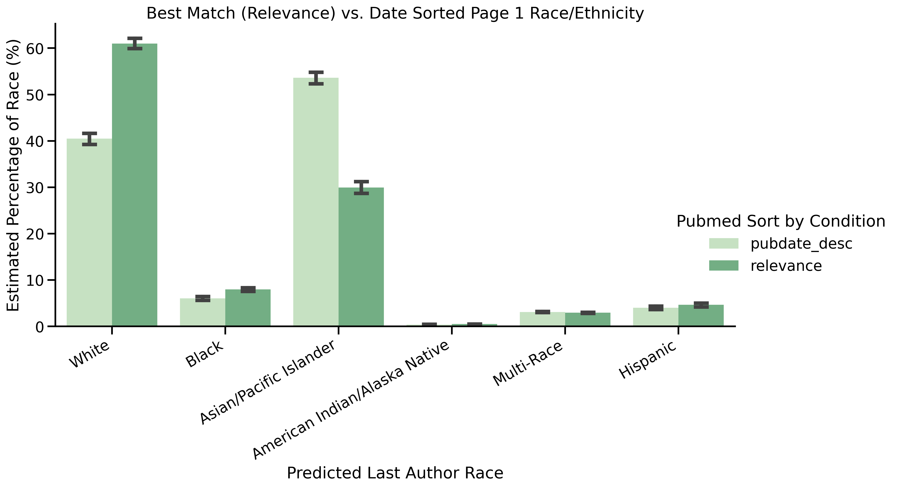
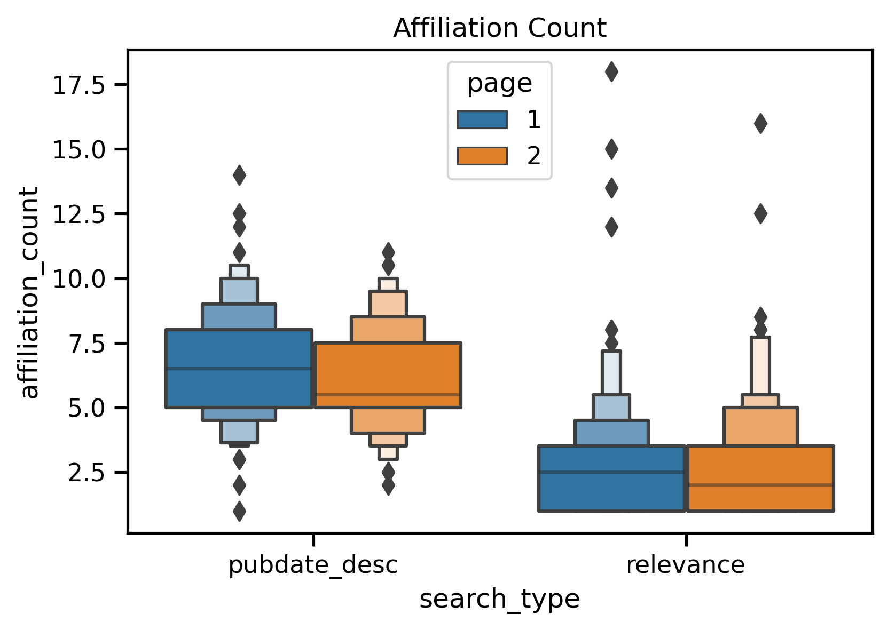
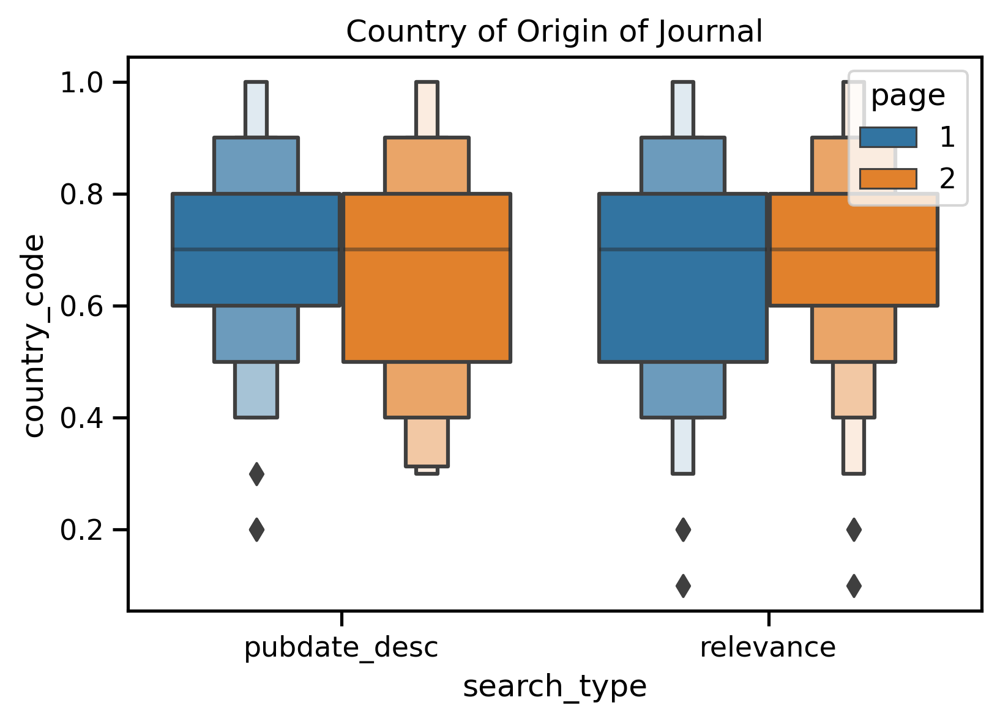
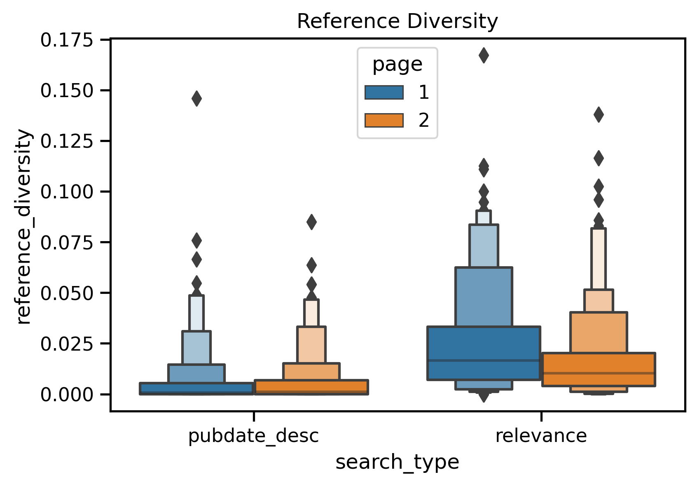

### Gender
 
 
 
 
 ### Race
 
 
 
 
 
 ### Author and Affiliation Counts
 
 
 
 
 
 
 
 
 
 
 
 
 
 
 
 

 [APT SCORE](https://github.com/NCBI-Codeathons/pubmed-codeathon-team1/blob/main/data/visualizations/apt_score.png)
 
 
 ### Research Focus (Human, Animal, or Mol/cellular)
 
 
 
 
